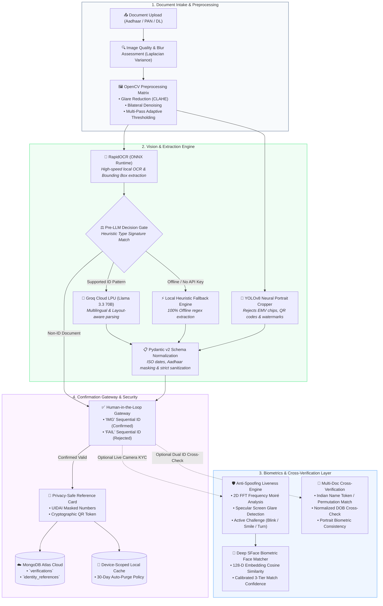

# 🏢 Utility Bot - Enterprise ID Verification, Biometric Face & Compliance Engine

[](https://fastapi.tiangolo.com)
[](https://react.dev)
[](https://github.com/ultralytics/ultralytics)
[-007ACC.svg?style=flat)](https://github.com/RapidAI/RapidOCR)
[-8A2BE2.svg?style=flat)](https://docs.opencv.org/)
[-F55036.svg?style=flat)](https://groq.com)
[](https://www.mongodb.com)
[](#-data-privacy--enterprise-security)

**Utility Bot** is a high-throughput, bank-grade identity verification and KYC compliance engine built for instant processing of Indian government identity documents (**Aadhaar Card**, **PAN Card**, and **Driving Licence**). 

The platform integrates **RapidOCR ONNX**, **YOLOv8 Face Detection**, **Deep SFace 128-D Biometric Face Recognition**, **Anti-Spoofing Liveness Detection**, **Multi-Document Cross-Verification**, and **Privacy-Safe Identity Reference Cards** to deliver sub-second verifications, zero false image crops, and full compliance with DPDP & UIDAI regulations.

---

## 📊 End-to-End System Architecture



---

## 🌟 Key Capabilities & Core Features

### 1. 🎯 Neural Portrait Extraction (YOLOv8 + Type-Aware Anchoring)
- Powered by `yolov8n-face.pt` with smart spatial anchoring.
- Automatically selects the appropriate portrait region based on document type:
  - **Aadhaar / Driving Licence:** Scans right side / header region.
  - **PAN Card:** Scans lower left quadrant.
- Ignores EMV smart chips, national emblems, holograms, and QR code patterns.

### 2. ⚡ Blazing-Fast Local OCR + Pre-LLM Resource Gate
- **RapidOCR (ONNX Runtime):** Runs pure Python ONNX inference locally without heavy external Tesseract dependencies.
- **Pre-LLM Decision Gate:** Automatically classifies text signatures before calling cloud models. Short-circuits invalid or non-ID documents in milliseconds, saving LLM tokens and computation.
- **Groq LPU Acceleration:** Sub-second extraction using **Llama 3.3 70B** for complex, blurred, or multilingual documents with fallback to pure local regex heuristics.

### 3. 👤 Biometric Face Matching & Anti-Spoofing Liveness (`NEW`)
- **Deep SFace 128-D Biometric Embeddings:** Utilizes OpenCV's official SFace ONNX neural net (`face_recognition_sface.onnx`) for deep facial feature extraction and cosine similarity scoring.
- **3-Tier Calibrated Match Confidence:**
  - `STRONG_MATCH` ($\ge 75\%$): Confirmed positive identity match (`Status: VERIFIED`).
  - `UNCERTAIN` ($50\% - 74\%$): Moderate match; prompts for Secondary ID verification (`Status: UNCERTAIN`).
  - `WEAK` ($< 50\%$): Biometric mismatch / failed verification (`Status: FAILED`).
- **Passive & Active Liveness Detection:**
  - **2D Fast Fourier Transform (FFT) Analysis:** Identifies high-frequency moiré patterns characteristic of digital screen re-capture or printed paper dot matrices.
  - **Specular Glare Detection:** Pinpoints reflective glass sheen produced by smartphone and tablet displays.
  - **Active Randomized Challenges:** Generates time-bounded liveness challenges (*Blink naturally, Smile, Turn head left/right*).

### 4. 📑 Multi-Document Cross-Verification Engine (`NEW`)
- Allows cross-checking a Primary ID against a Secondary ID (e.g., Aadhaar $\leftrightarrow$ PAN or PAN $\leftrightarrow$ DL).
- **Indian Naming Permutation & Heuristics:**
  - Resolves name order flips (*"S Kiruthikeyan"* $\leftrightarrow$ *"Kiruthikeyan S"*).
  - Handles initial expansions (*"Shanmugam Kiruthikeyan"* $\leftrightarrow$ *"S Kiruthikeyan"*).
  - Normalizes honorifics (*Shri, Smt, Dr, Mr, Mrs, Master, Kumar*).
- **Normalized Date of Birth Cross-Check:** Resolves string date variations and year-only formats (`YYYY` vs `DD/MM/YYYY`).
- **Biometric Cross-Comparison:** Performs deep face similarity between photos extracted across both physical cards.

### 5. 🪪 Privacy-Safe Reference Cards & UIDAI Aadhaar Masking
- Generates customer-facing **Identity Reference Cards** upon verification.
- Enforces strict Aadhaar masking (**`********2222`**)—only the last 4 digits are stored or displayed.
- Generates scannable cryptographic QR codes for instant verification lookup.
- Supports single-click **Instant Revocation** (`/reference/{ref_id}/revoke`).

### 6. 🕒 Enterprise Storage & 30-Day Retention Compliance
- **Dual-Write Architecture:** Automatically mirrors records between **MongoDB Atlas Cloud** and a high-performance **Local In-Memory Store**.
- **Station Device ID Isolation:** Scopes verification records per workstation via `X-Device-Id` headers.
- **30-Day Statutory Auto-Purge:** Automatic background cleaner removes stale PII records in compliance with DPDP data minimization rules.

---

## 💼 Performance Benchmarks (KPIs)

| Metric | Manual Human KYC | Standard OCR API | Utility Bot AI Engine |
| :--- | :---: | :---: | :---: |
| **Verification Speed** | 5 – 10 Minutes | 3 – 5 Seconds | **⚡ < 1.2 Seconds** |
| **Portrait Extraction** | Manual Cropping | ❌ Bounding Box Only | **🎯 YOLOv8 Face Detection** |
| **Live Biometric Match** | Visual inspection | ❌ Not Included | **👤 Deep SFace 128-D Cosine Match** |
| **Anti-Spoofing Liveness**| None | ❌ Extra Paid Addon | **🛡️ FFT Moiré + Specular Glare** |
| **Dual-ID Cross Check** | Manual comparison | ❌ Manual | **📑 Automated Fuzzy Cross-Check** |
| **Privacy Compliance** | Paper photocopies | Cloud PII Storage | **🔒 UIDAI Masking + Ref Cards** |
| **Local Compute Cost** | High Labor Cost | Per-call API fees | **$0.00 Local ONNX Execution** |

---

## 🛠️ Technology Stack

### **Backend (Python 3.10+)**
- **FastAPI & Uvicorn**: Asynchronous high-performance REST API.
- **RapidOCR & ONNX Runtime**: High-speed offline text detection and recognition.
- **OpenCV SFace & YOLOv8 (`ultralytics`)**: Neural facial detection and 128-dimensional biometric embedding cosine matching.
- **Groq SDK**: Cloud LPU LLM inference (`Llama 3.3 70B`).
- **Pydantic v2**: Strict schema validation and data normalization.
- **PyMongo**: Cloud MongoDB Atlas integration with local failover.

### **Frontend (React 18 + Vite)**
- **React 18 & Vite**: Modern reactive single-page dashboard.
- **Tailwind CSS**: High-contrast, clean enterprise UI.
- **Lucide Icons**: Crisp iconography.
- **QRCode.react**: Cryptographic QR code generation for Identity Reference Cards.
- **Webcam & Canvas APIs**: Real-time live camera capture and liveness evaluation.

---

## 🔒 Data Privacy & Enterprise Security

1. **In-Memory Volatile Processing**: Original high-resolution document images are handled strictly in RAM and never written to unencrypted disk storage.
2. **UIDAI Compliance**: Strict 8-digit masking applied immediately during normalization before storage or transmission.
3. **Audit Trails**: Differentiates confirmed verifications (`IMG...` series) and rejected audit attempts (`FAIL...` series).
4. **Device Scoping**: Station separation using `X-Device-Id` headers ensures client workspace privacy.

---

## ⚙️ Environment Configuration

Create a `.env` file in the `python_service/` directory:

```env
# ==============================================================================
# Utility Bot - Environment Configuration
# ==============================================================================

# MongoDB Atlas Cloud Database URI (Optional)
# If omitted, records are saved safely in the local in-memory storage.
MONGODB_URI=mongodb+srv://<username>:<password>@cluster0.xxxxx.mongodb.net/utility_bot?retryWrites=true&w=majority

# Groq Cloud LLM API Key (Optional)
# If omitted, the system runs 100% offline using RapidOCR and local regex heuristics.
GROQ_API_KEY=

# Groq LLM Model Name
GROQ_MODEL=llama-3.3-70b-versatile
```

---

## 🚀 Quickstart Guide

### **Prerequisites**
- **Python 3.10+**
- **Node.js 18+** & **npm**

---

### **Option 1: Development Mode (2 Terminals)**

#### **Terminal 1: Start Backend (FastAPI)**
```powershell
cd python_service
pip install -r requirements.txt
python -m uvicorn main:app --host 0.0.0.0 --port 8000 --reload
```
- **Backend API:** `http://localhost:8000`
- **Interactive Swagger Docs:** `http://localhost:8000/docs`

#### **Terminal 2: Start Frontend (React + Vite)**
```powershell
cd client
npm install
npm run dev
```
- **Web Dashboard:** `http://localhost:5173`

---

### **Option 2: Unified Production Server (1 Terminal)**

Build the React frontend into static assets and serve both frontend and backend through FastAPI:

```powershell
# 1. Build the React Client
cd client
npm install
npm run build

# 2. Start the Unified Server
cd ../python_service
pip install -r requirements.txt
python main.py
```
- Open `http://localhost:8000` in your browser.

---

## 📡 REST API Reference

### **Document Extraction & Confirmation**
| Method | Endpoint | Description |
| :--- | :--- | :--- |
| `POST` | `/extract` | Upload identity image; executes Pre-LLM Gate, YOLO portrait crop, RapidOCR, and Pydantic normalization. |
| `POST` | `/confirm` | Confirms extracted details, creates Privacy Reference Card, and records `IMG...` / `FAIL...` sequential ID. |
| `GET` | `/models` | Returns available LLM models for extraction. |

### **Biometric Face & Liveness Verification**
| Method | Endpoint | Description |
| :--- | :--- | :--- |
| `GET` | `/verify/liveness-challenge` | Generates active randomized liveness challenge token (*blink, smile, head turn*). |
| `POST` | `/verify/live-face` | Anti-spoofing liveness check & Deep SFace 128-D cosine face matching against ID card portrait. |
| `POST` | `/verify/second-id` | Cross-verifies primary ID with secondary ID (fuzzy Indian name match, DOB consistency, portrait face match). |

### **Identity Reference Cards & Verification QR**
| Method | Endpoint | Description |
| :--- | :--- | :--- |
| `GET` | `/reference/{ref_id}` | Public endpoint retrieving privacy-masked reference card details. |
| `POST` | `/reference/{ref_id}/revoke` | Revokes an active Reference Card immediately. |

### **History & Storage Management**
| Method | Endpoint | Description |
| :--- | :--- | :--- |
| `GET` | `/history` | Returns paginated list of successful verifications (`IMG...` series) for current station. |
| `GET` | `/failed-history` | Returns failed verification audit records (`FAIL...` series). |
| `GET` | `/history/{doc_id}` | Retrieves a single verification record by sequential ID. |
| `DELETE`| `/history/{doc_id}` | Deletes a verification record. |
| `GET` | `/storage/stats` | Returns database and storage usage metrics. |
| `POST` | `/storage/clean` | Triggers 30-day statutory retention cleanup. |
| `GET` | `/health` | Returns service health, OCR readiness, and database connection status. |

---

## 📄 License
Distributed under the **MIT Enterprise License**.
