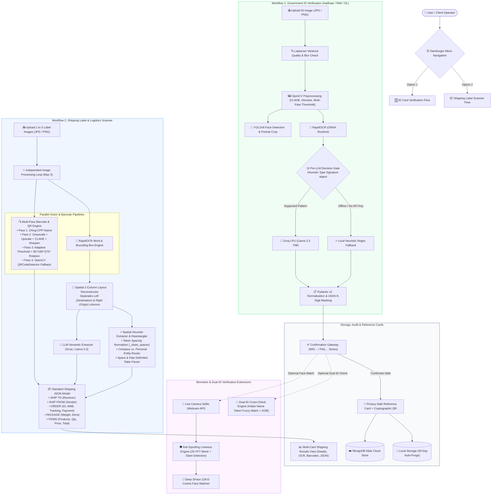

# 🏢 Utility Bot - Enterprise ID Verification, Biometrics & Shipping Intelligence Engine

[](https://fastapi.tiangolo.com)
[](https://react.dev)
[](https://github.com/zxing-cpp/zxing-cpp)
[](https://github.com/ultralytics/ultralytics)
[-007ACC.svg?style=flat)](https://github.com/RapidAI/RapidOCR)
[-8A2BE2.svg?style=flat)](https://docs.opencv.org/)
[-F55036.svg?style=flat)](https://groq.com)
[](https://www.mongodb.com)
[](#-data-privacy--enterprise-security)

**Utility Bot** is an enterprise-grade AI automation suite providing two production workflows in a single unified system:
1. **🆔 Government ID Card Verification & Biometric KYC**: Instant classification, portrait extraction, Aadhaar masking, SFace 128-D biometric face matching, anti-spoofing liveness, dual-ID cross-verification, and cryptographically verified Identity Reference Cards.
2. **📦 Shipping Label Scanner & Logistics Extraction**: Multi-image batch processing (1–3 parcel labels simultaneously), multi-pass Barcode & QR matrix decoding (`zxing-cpp`), spatial 2-column layout reconstruction, and intelligent extraction of **SHIP TO**, **SHIP FROM**, **ORDER**, **PACKAGE**, and **ITEMS / PRODUCT MANIFEST**.

---

## 🗺️ Complete Dual-Engine System Architecture


```mermaid
flowchart TD
    %% NAVIGATION GATEWAY
    User(["👤 User / Client Operator"]) --> NavChoice{"☰ Hamburger Menu Navigation"}
    
    NavChoice -->|Option 1| IDFlow["🆔 ID Card Verification Flow"]
    NavChoice -->|Option 2| ShippingFlow["📦 Shipping Label Scanner Flow"]

    %% ==========================================
    %% WORKFLOW 1: ID VERIFICATION
    %% ==========================================
    subgraph IDWorkflow["Workflow 1: Government ID Verification (Aadhaar / PAN / DL)"]
        IDUpload["📤 Upload ID Image (JPG / PNG)"]
        QualityCheck["🔍 Laplacian Variance Quality & Blur Check"]
        IDPreproc["🖼️ OpenCV Preprocessing (CLAHE, Denoise, Multi-Pass Threshold)"]
        YOLOCrop["🎯 YOLOv8 Face Detection & Portrait Crop"]
        RapidID["📖 RapidOCR (ONNX Runtime)"]
        DecisionGate{"⚖️ Pre-LLM Decision Gate<br/><i>Heuristic Type Signature Match</i>"}
        GroqID["🧠 Groq LPU (Llama 3.3 70B)"]
        RegexID["⚡ Local Heuristic Regex Fallback"]
        PydanticID["📋 Pydantic v2 Normalization & UIDAI 8-Digit Masking"]
        
        IDUpload --> QualityCheck --> IDPreproc
        IDPreproc --> YOLOCrop
        IDPreproc --> RapidID
        RapidID --> DecisionGate
        DecisionGate -->|Supported Pattern| GroqID --> PydanticID
        DecisionGate -->|Offline / No API Key| RegexID --> PydanticID
    end

    %% ==========================================
    %% WORKFLOW 2: SHIPPING LABEL SCANNER
    %% ==========================================
    subgraph ShipWorkflow["Workflow 2: Shipping Label & Logistics Scanner"]
        ShipUpload["📤 Upload 1 to 3 Label Images (JPG / PNG)"]
        MultiLoop["🔁 Independent Image Processing Loop (Max 3)"]
        
        subgraph ParallelEngines["Parallel Vision & Barcode Pipelines"]
            CodeScan["🔍 Multi-Pass Barcode & QR Engine<br/>• Pass 1: ZXing-CPP Native<br/>• Pass 2: Grayscale + Upscale + CLAHE + Sharpen<br/>• Pass 3: Adaptive Threshold + 90°/180°/270° Rotation<br/>• Pass 4: OpenCV QRCodeDetector Fallback"]
            RapidShip["📖 RapidOCR Word & Bounding Box Engine"]
        end
        
        SpatialSort["📐 Spatial 2-Column Layout Reconstructor<br/><i>Separates Left (Destination) & Right (Origin) columns</i>"]
        ShipLLM["🧠 LLM Semantic Extractor (Groq / Llama 3.3)"]
        ShipHeuristics["⚡ Spatial Heuristic Extractor & Disentangler<br/>• Token Spacing Normalizer (_clean_spaces)<br/>• Company vs. Personal Entity Router<br/>• Space & Pipe Delimited Table Parser"]
        ShipSchema["📦 Standard Shipping JSON Model<br/>• SHIP TO (Receiver)<br/>• SHIP FROM (Sender)<br/>• ORDER (ID, AWB, Tracking, Payment)<br/>• PACKAGE (Weight, Dims)<br/>• ITEMS (Products, Qty, Price, Total)"]
        
        ShipUpload --> MultiLoop
        MultiLoop --> CodeScan
        MultiLoop --> RapidShip
        RapidShip --> SpatialSort
        SpatialSort --> ShipLLM --> ShipSchema
        SpatialSort --> ShipHeuristics --> ShipSchema
        CodeScan --> ShipSchema
    end

    %% BIOMETRICS & VERIFICATION EXTENSIONS
    subgraph KYCBiometrics["Biometric & Dual-ID Verification Extensions"]
        LiveSelfie["🤳 Live Camera Selfie (Webcam API)"]
        LivenessEng["🛡️ Anti-Spoofing Liveness Engine (2D FFT Moiré + Glare Detection)"]
        SFace["👤 Deep SFace 128-D Cosine Face Matcher"]
        CrossDoc["📑 Dual-ID Cross-Check Engine (Indian Name Token Fuzzy Match + DOB)"]
    end

    %% FINAL OUTPUTS
    subgraph StorageGateways["Storage, Audit & Reference Cards"]
        ConfirmGate["✅ Confirmation Gateway (IMG... / FAIL... Series)"]
        RefCardGen["🪪 Privacy-Safe Reference Card + Cryptographic QR"]
        MongoStorage[("☁️ MongoDB Atlas Cloud Store")]
        LocalStorage[("📁 Local Storage (30-Day Auto-Purge)")]
        ShippingCards["📊 Multi-Card Shipping Results View (Details, OCR, Barcodes, JSON)"]
    end

    PydanticID --> ConfirmGate
    ConfirmGate -.->|Optional Face Match| LiveSelfie --> LivenessEng --> SFace
    ConfirmGate -.->|Optional Dual ID Check| CrossDoc
    ConfirmGate -->|Confirmed Valid| RefCardGen
    RefCardGen --> MongoStorage
    RefCardGen --> LocalStorage
    ShipSchema --> ShippingCards

    %% Styling
    style IDWorkflow fill:#f0fdf4,stroke:#86efac,stroke-width:2px;
    style ShipWorkflow fill:#eff6ff,stroke:#93c5fd,stroke-width:2px;
    style KYCBiometrics fill:#fdf4ff,stroke:#d8b4fe,stroke-width:2px;
    style StorageGateways fill:#f8fafc,stroke:#94a3b8,stroke-width:2px;
```

---

## 🔄 Detailed Step-by-Step Workflows

###  workflow 1: Government ID Card Verification & Biometric KYC

```
[ID Image Upload] ──> [Image Quality Assessment] ──> [OpenCV Preprocessing]
         │
         ├───> [YOLOv8 Face Detection] ───────> [Portrait Photo Crop]
         │
         └───> [RapidOCR ONNX Engine] ────────> [Pre-LLM Decision Gate]
                                                        │
                                                        ├───> [Groq Llama 3.3] ──┐
                                                        │                         ├──> [Pydantic Normalization]
                                                        └───> [Local Regex] ─────┘              │
                                                                                                ▼
[Cryptographic Reference Card] <─── [Human Confirmation] <─── [SFace Biometric Face Match (Optional)]
```

1. **Intake & Quality Gate**:
   - The user uploads an Indian ID document (Aadhaar Card, PAN Card, or Driving Licence).
   - The Laplacian variance engine evaluates blur, glare, and resolution before processing.
2. **Neural Face Detection (`YOLOv8`)**:
   - Locates facial features with spatial anchoring (right header for Aadhaar/DL, lower-left for PAN).
   - Rejects EMV chips, hologram stickers, national emblems, and QR pattern false positives.
3. **OCR & Decision Gate**:
   - **RapidOCR ONNX** extracts high-precision text and word coordinates locally in $< 300\text{ ms}$.
   - The **Pre-LLM Decision Gate** checks heuristic signatures. If supported, streams to **Groq Llama 3.3 70B**; otherwise falls back to the offline regex engine.
4. **UIDAI Aadhaar Masking & Normalization**:
   - Enforces strict Aadhaar masking (**`********1234`**) and ISO-8601 date formatting.
5. **Biometric Face Match & Liveness (Optional)**:
   - Compares the cropped ID photo against a live selfie using OpenCV's **Deep SFace 128-D** model with anti-spoofing FFT moiré frequency analysis.
6. **Reference Card Generation**:
   - Creates a privacy-compliant digital Identity Reference Card with scannable cryptographic QR token.

---

### workflow 2: Shipping Label Scanner & Logistics Intelligence

```
[1 to 3 Shipping Label Images] (JPG, JPEG, PNG)
         │
         ├───> [Image 1] ───> [Parallel ZXing-CPP + RapidOCR] ───> [Spatial 2-Column Sorter] ───> [Result Card #1]
         ├───> [Image 2] ───> [Parallel ZXing-CPP + RapidOCR] ───> [Spatial 2-Column Sorter] ───> [Result Card #2]
         └───> [Image 3] ───> [Parallel ZXing-CPP + RapidOCR] ───> [Spatial 2-Column Sorter] ───> [Result Card #3]
```

1. **Multi-Image Upload (Max 3 Images)**:
   - Operators can upload **1, 2, or 3 images simultaneously** (JPG, JPEG, PNG).
   - Each image is executed **strictly independently** through the extraction pipeline without data cross-contamination.
2. **Multi-Pass Barcode & QR Code Engine (`code_reader.py`)**:
   - **Pass 1:** Native high-speed `zxing-cpp` scan across 1D/2D symbologies (Code 128, Code 39, EAN-13, QR Code, Data Matrix, PDF417).
   - **Pass 2 (Image Enhancement):** Grayscale $\to$ $2\times$ Upscale $\to$ CLAHE contrast equalization $\to$ Kernel sharpening.
   - **Pass 3 (Multi-Angle Thresholding):** Otsu and adaptive thresholding with $90^\circ$, $180^\circ$, and $270^\circ$ rotations.
   - **Pass 4 (OpenCV Fallback):** `cv2.QRCodeDetector` recovery.
   - **Deduplication:** Automatically deduplicates codes using `(format, value)`.
3. **Spatial 2-Column Layout Reconstructor (`shipping_extractor.py`)**:
   - Detects side-by-side / two-column layouts (e.g., Destination block on left, Return/Shipper block on right).
   - Re-orders the reading stream column-by-column (reads full Left Column top-to-bottom, then Right Column top-to-bottom), completely eliminating horizontal text concatenation bugs.
4. **Intelligent Field Extraction & Post-Processing**:
   - **SHIP TO (Receiver):** Name, Phone, Email, Address, City, State, Postal Code, Country.
   - **SHIP FROM (Sender):** Name, Company, Phone, Email, Address, City, State, Postal Code, Country.
   - **ORDER & TRACKING:** Order ID, Tracking Number, AWB Number, Shipping Date, Payment Type (`COD` / `PREPAID`), Remarks.
   - **PACKAGE INFORMATION:** Weight (e.g. `5oz`, `1.5 KG`) and Dimensions.
   - **PRODUCT ITEMS MANIFEST:** Pipe-separated (`|`) and space-delimited table rows parsed into product name, quantity, unit price, and total amount.
   - **Entity Disentanglement:** Validates 10–12 digit phone numbers (retains non-digit text in address) and routes corporate names to `SHIP FROM` and individual customer names to `SHIP TO`.
5. **Multi-Card Interactive UI**:
   - Displays dedicated result cards per uploaded label with **Details**, **OCR Text**, **Barcode / QR**, and **JSON Payload** tabs.

---

## 🌟 Key Capabilities & Feature Highlights

| Capability | ID Verification Engine | Shipping Label Scanner |
| :--- | :--- | :--- |
| **Input Support** | Single ID Document (Aadhaar, PAN, DL) | Batch 1 to 3 Shipping Labels (JPG/PNG) |
| **Core OCR** | RapidOCR ONNX Runtime ($< 300\text{ ms}$) | RapidOCR ONNX + Spatial Layout Reconstructor |
| **Code Scanning** | Embedded Document QR Reader | Multi-Pass Barcode & QR Reader (`zxing-cpp`) |
| **Vision AI** | YOLOv8 Neural Portrait Cropper | 2-Column Cluster Detection & Column Sorter |
| **LLM Inference** | Groq Cloud LPU (Llama 3.3 70B) | Groq Cloud LPU with Spatial Prompt Rules |
| **Offline Fallback**| 100% Offline Local Regex Engine | 100% Offline Spatial Heuristic Parser |
| **Biometrics** | Deep SFace 128-D Cosine Face Matching | N/A (Logistics-focused) |
| **Anti-Spoofing** | 2D FFT Moiré + Specular Glare Detection | N/A |
| **Data Privacy** | UIDAI 8-Digit Masking (`********1234`) | Station-isolated temporary processing |

---

## 🛠️ Technology Stack

### **Backend (Python 3.10+)**
- **FastAPI & Uvicorn**: High-throughput asynchronous REST API framework.
- **RapidOCR & ONNX Runtime**: Local deep-learning OCR without external binary dependencies.
- **ZXing-CPP (`zxing-cpp`)**: Native C++ port for multi-format 1D/2D barcode and QR matrix decoding.
- **OpenCV & Deep SFace**: Image preprocessing, geometric transformations, and 128-D biometric facial embeddings.
- **Ultralytics YOLOv8**: Neural face detection and anchored portrait photo extraction.
- **Groq Python SDK**: Cloud LPU ultra-low latency LLM inference.
- **Pydantic v2**: Strict schema validation and JSON serialization.
- **PyMongo**: MongoDB Atlas cloud integration with local storage fallback.

### **Frontend (React 18 + Vite)**
- **React 18 & Vite**: Lightning-fast single-page reactive dashboard.
- **Tailwind CSS**: Enterprise clean UI with responsive typography and dark-mode accents.
- **Lucide React**: Clean SVG iconography.
- **QRCode.react**: Cryptographic QR token generation for verification cards.

---

## ⚙️ Environment Configuration

Create a `.env` file in the `python_service/` directory:

```env
# ==============================================================================
# Utility Bot - Environment Configuration
# ==============================================================================

# MongoDB Atlas Cloud Database URI (Optional)
# If omitted, records are saved safely in the local in-memory storage.
MONGODB_URI=mongodb+srv://<username>:<password>@cluster0.xxxxx.mongodb.net/utility_bot?retryWrites=true&w=majority

# Groq Cloud LLM API Key (Optional)
# If omitted, the system runs 100% offline using RapidOCR and local regex heuristics.
GROQ_API_KEY=gsk_your_groq_api_key_here

# Groq LLM Model Name
GROQ_MODEL=llama-3.3-70b-versatile
```

---

## 🚀 Quickstart Guide

### **Prerequisites**
- **Python 3.10+** (Compatible with Python 3.10 – 3.14+)
- **Node.js 18+** & **npm**

---

### **Option 1: Fastest Root Launch (Single Command)**

Launch the full stack directly from the workspace root (serves both React GUI & FastAPI backend on port 8000):

```powershell
# 1. Install Python dependencies
pip install -r python_service/requirements.txt

# 2. Run the unified launcher
python run.py
```

- **Unified Web Dashboard:** `http://localhost:8000`
- **Interactive Swagger API Docs:** `http://localhost:8000/docs`

---

### **Option 2: Development Mode (Hot-Reloading 2 Terminals)**

Use this mode when actively developing the React frontend:

#### **Terminal 1: Start Backend (FastAPI)**
```powershell
cd python_service
pip install -r requirements.txt
python -m uvicorn main:app --host 0.0.0.0 --port 8000 --reload
```
- **Backend API:** `http://localhost:8000`
- **Swagger Docs:** `http://localhost:8000/docs`

#### **Terminal 2: Start Frontend (React + Vite)**
```powershell
cd client
npm install
npm run dev
```
- **Web Dashboard:** `http://localhost:5173`

*(On Windows, you can also double-click `run-dev.bat` to launch both terminals automatically).*

---

### **Option 3: Docker Deployment (Railway, Render, AWS, GCP)**

```powershell
# Build container image
docker build -t utility-bot .

# Run container on port 8000
docker run -p 8000:8000 utility-bot
```

---

## 🧪 Automated Verification Suite

Run the comprehensive 11-module automated test suite covering all regex heuristics, validation rules, SFace biometrics, cross-checks, and multi-column shipping labels:

```powershell
python python_service/test_pipeline.py
```

```
============================================================
RUNNING UTILITY BOT ENTERPRISE TEST SUITE
============================================================
Testing Date Normalization...
  [PASS] Date Normalization tests passed.
Testing PAN Validation...
  [PASS] PAN Validation tests passed.
Testing Aadhaar Validation & Masking...
  [PASS] Aadhaar Validation tests passed.
Testing Driving Licence Validation...
  [PASS] Driving Licence Validation tests passed.
Testing Heuristic Document Classifier...
  [PASS] Heuristic Classification tests passed.
Testing OpenCV Preprocessing Pipeline...
  [PASS] OpenCV Preprocessing tests passed.
Testing End-to-End Extraction Result Assembly...
  [PASS] Extraction Result Assembly passed.
Testing Reference Card Generation & Masking...
  [PASS] Reference Card Service tests passed.
Testing Liveness & Anti-Spoofing...
  [PASS] Liveness & Anti-Spoofing tests passed.
Testing Multi-Document Cross-Verification...
  [PASS] Multi-Document Cross-Verification tests passed.
Testing Shipping Label LLM & Heuristic Extraction...
  [PASS] Shipping Label LLM & Heuristic Extraction tests passed (Domestic, USPS, Unspaced OCR, Tables & 2-Column).
============================================================
ALL 11 TEST SUITES PASSED SUCCESSFULLY! [SUCCESS]
============================================================
```

---

## 📡 REST API Reference

### **1. Shipping Label & Logistics Scanner**
| Method | Endpoint | Description |
| :--- | :--- | :--- |
| `POST` | `/extract-shipping` | Upload 1 to 3 shipping labels (`files: List[UploadFile]`). Runs parallel multi-pass ZXing-CPP Barcode/QR decoding, RapidOCR, 2-column spatial reconstruction, and LLM/heuristic extraction. Returns separate JSON result per image. |

### **2. Document Extraction & Confirmation**
| Method | Endpoint | Description |
| :--- | :--- | :--- |
| `POST` | `/extract` | Upload identity image; executes Pre-LLM Gate, YOLOv8 portrait crop, RapidOCR, and Pydantic normalization. |
| `POST` | `/confirm` | Confirms extracted details, creates Privacy Reference Card, and records `IMG...` / `FAIL...` sequential ID. |
| `GET` | `/models` | Returns available LLM models for extraction. |

### **3. Biometric Face & Liveness Verification**
| Method | Endpoint | Description |
| :--- | :--- | :--- |
| `GET` | `/verify/liveness-challenge` | Generates active randomized liveness challenge token (*blink, smile, head turn*). |
| `POST` | `/verify/live-face` | Anti-spoofing liveness check & Deep SFace 128-D cosine face matching against ID card portrait. |
| `POST` | `/verify/second-id` | Cross-verifies primary ID with secondary ID (fuzzy Indian name match, DOB consistency, portrait face match). |

### **4. Identity Reference Cards & Verification QR**
| Method | Endpoint | Description |
| :--- | :--- | :--- |
| `GET` | `/reference/{ref_id}` | Public endpoint retrieving privacy-masked reference card details. |
| `POST` | `/reference/{ref_id}/revoke` | Revokes an active Reference Card immediately. |

### **5. History & Storage Management**
| Method | Endpoint | Description |
| :--- | :--- | :--- |
| `GET` | `/history` | Returns paginated list of successful verifications (`IMG...` series). |
| `GET` | `/failed-history` | Returns failed verification audit records (`FAIL...` series). |
| `GET` | `/history/{doc_id}` | Retrieves a single verification record by sequential ID. |
| `DELETE`| `/history/{doc_id}` | Deletes a verification record. |
| `GET` | `/storage/stats` | Returns database and storage usage metrics. |
| `POST` | `/storage/clean` | Triggers 30-day statutory retention cleanup. |
| `GET` | `/health` | Returns service health, OCR readiness, and database connection status. |

---

## 🔒 Data Privacy & Enterprise Security

1. **In-Memory Volatile Processing**: Original high-resolution document images are handled strictly in RAM and never written to unencrypted disk storage.
2. **UIDAI Compliance**: Strict 8-digit masking applied immediately during normalization before storage or transmission.
3. **Audit Trails**: Differentiates confirmed verifications (`IMG...` series) and rejected audit attempts (`FAIL...` series).
4. **Device Scoping**: Station separation using `X-Device-Id` headers ensures client workspace privacy.

---

## 📄 License
Distributed under the **MIT Enterprise License**.
